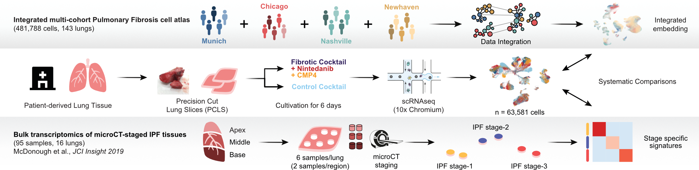

# *Ex vivo* tissue perturbations coupled to single cell RNA-seq reveal multi-lineage cell circuit dynamics in human lung fibrogenesis

## Abstract

Pulmonary fibrosis develops as a consequence of failed regeneration after injury. Analyzing mechanisms of regeneration and fibrogenesis directly in human tissue has been hampered by the lack of organotypic models and analytical techniques. In this work, we coupled ex vivo cytokine and drug perturbations of human precision-cut lung slices (hPCLS) with scRNAseq and induced a multi-lineage circuit of fibrogenic cell states in hPCLS, which we show to be highly similar to the in vivo cell circuit in a multi-cohort lung cell atlas from pulmonary fibrosis patients. Using micro-CT staged patient tissues, we characterized the appearance and interaction of myofibroblasts, an ectopic endothelial cell state and basaloid epithelial cells in the thickened alveolar septum of early-stage lung fibrosis. Induction of these states in the ex vivo hPCLS model provides evidence that the basaloid cell state was derived from alveolar type-2 cells, whereas the ectopic endothelial cell state emerged from capillary cell plasticity. Cell-cell communication routes in patients were largely conserved in the hPCLS model and anti-fibrotic drug treatments showed highly cell type specific effects. Our work provides an experimental framework for perturbational single cell genomics directly in human lung tissue that enables analysis of tissue homeostasis, regeneration and pathology. We further demonstrate that hPCLS offers novel avenues for scalable, high-resolution drug testing to accelerate anti-fibrotic drug development and translation.

## Citation

Niklas J. Lang\*, Janine Gote-Schniering\*, Diana Porras-Gonzalez, Lin Yang, Laurens J. De Sadeleer, R. Christoph Jentzsch, Vladimir A. Shitov, Shuhong Zhou, Meshal Ansari, Ahmed Agami, Christoph H. Mayr, Baharak Hooshiar Kashani, Yuexin Chen, Lukas Heumos, Jeanine C. Pestoni, , Eszter Sarolta Molnar, Emiel Geeraerts, Vincent Anquetil, Laurent Saniere, Melanie Wögrath, Michael Gerckens, Mareike Lehmann, Ali Önder Yildirim, Rudolf Hatz, Nikolaus Kneidinger, Jürgen Behr, Wim A. Wuyts, Mircea-Gabriel Stoleriu, Malte D. Luecken, Fabian J. Theis, Gerald Burgstaller\#, and Herbert B. Schiller\#.\
**[*Ex vivo* tissue perturbations coupled to single cell RNA-seq reveal multi-lineage cell circuit dynamics in human lung fibrogenesis.](https://doi.org/10.1126/scitranslmed.adh0908)** *Science Translational Medicine Vol 15, Issue 725*, 2023.

\* Co-first authors

\# Corresponding authors

## Data availability

Processed count tables to reproduce the analyses in the paper are available on [Zenodo](https://doi.org/10.5281/zenodo.7537493).

Publicly available single cell RNA-seq datasets used to generate the integrated Pulmonary Fibrosis cell atlas can be accessed under the following GEO accession numbers: [GSE136831](https://www.ncbi.nlm.nih.gov/geo/query/acc.cgi?acc=GSE136831) (New Haven cohort), [GSE122960](https://www.ncbi.nlm.nih.gov/geo/query/acc.cgi?acc=GSE122960) (Chicago cohort), [GSE135893](https://www.ncbi.nlm.nih.gov/geo/query/acc.cgi?acc=GSE135893) (Nashville cohort), and on [GitHub](https://github.com/theislab/2020_Mayr) (Munich cohort).
Publicly available bulk RNA-seq data from microCT staged IPF tissues re-analysed in this study can be accessed under the following GEO accession number: [GSE124685](https://www.ncbi.nlm.nih.gov/geo/query/acc.cgi?acc=GSE124685).

## Code availability

- Code to analyse *ex vivo* (hPCLS) data: *HUMAN_exvivo* directory
- Code to analyse *in vivo* (integrated Pulmonary Fibrosis (PF) cell atlas) data: *HUMAN_invivo* directory
- Code for systematic comparison of *in vivo* and *ex vivo* data: *HUMAN_invivo_exvivo_comparison* directory
- Code for scArches mapping of hPCLS (*ex vivo* query) to PF-extended HLCA (*in vivo* reference): *HUMAN_scArches_mapping* directory
- Conda environments used for the analyses: \*.yml files

## Acknowledgements

Massive thanks to [Meshal Ansari](https://github.com/Mesh09) and [Lukas Heumos](https://github.com/Zethson) for pre-processing the raw reads, providing feedback and all the fruitful discussions throughout the project, as well as [Vladimir Shitov](https://github.com/VladimirShitov) for mapping the hPCLS data to the extended Human Lung Cell Atlas (HLCA).
